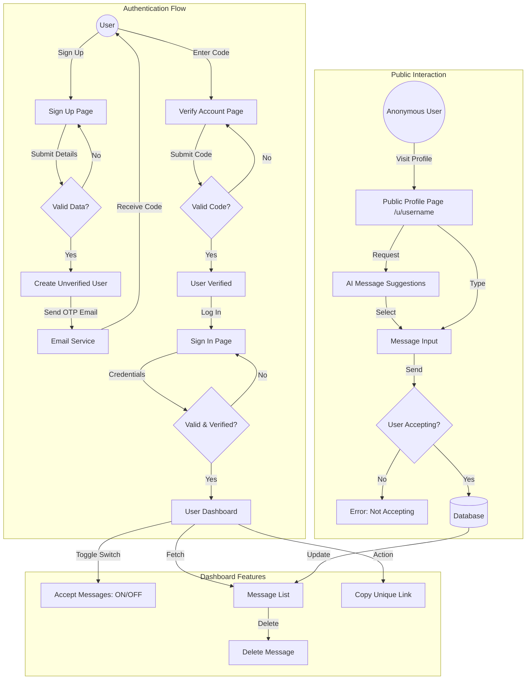

# Nextfile — Next.js Project

**Nextfile** is a learning project built with **Next.js** (React framework) as I explore modern full-stack web development.  
This repository currently serves as a starter app and playground for learning Next.js concepts like routing, components, API routes, styling, and deployment.

> ⚠️ This project is incomplete and under active development.

---

## 🚀 About the Project

This project was bootstrapped with **Create Next App** using **Next.js**. Next.js is a powerful React framework for building server-rendered and statically generated web applications. :contentReference[oaicite:0]{index=0}

At its current state, the app includes the default Next.js template structure and basic setup. The goal is to expand it with real features — such as file handling, components, email handling, backend APIs, database integration, etc.

---

## 🧠 Learning Goals

This repository helps me learn and experiment with Next.js features:

- 📄 **App Router (New in Next.js)**
- 🧩 **Reusable Components**
- 📫 **API Routes**
- 🗃️ **File Upload / Handling**
- 💅 **Styling (Tailwind / CSS Modules or any UI library)**
- 🚀 **Deployment (Vercel / Netlify / Render)**

More features will be added as I learn and implement them.

---

## 🛠️ Tech Stack

| Feature | Description |
|---------|-------------|
| **Next.js** | Framework for React apps with SSR/SSG support :contentReference[oaicite:1]{index=1} |
| **TypeScript** | Typed JavaScript for better DX |
| **React** | UI component library |
| **Tailwind CSS** | Utility-first styling (if used) |
| **Node.js / API Routes** | Backend logic in Next.js |

---

## 📦 Installation

To run this project locally, make sure you have **Node.js (>=16)** installed.

1. **Clone the repository**
   ```bash
   git clone https://github.com/Ro706/nextfile.git
   cd nextfile
    ```

2. **Install dependencies**

   ```bash
   npm install
   # or
   yarn
   ```

3. **Run development server**

   ```bash
   npm run dev
   # or
   yarn dev
   ```

4. **View in browser**
   Open [http://localhost:3000](http://localhost:3000) to explore your app.

---

## 📁 Project Structure

```
.
├── app/                # Next.js app routes & pages
├── component/          # React components
├── email/              # Email logic & templates (work in progress)
├── lib/                # Utility libraries
├── model/              # Data models / types
├── public/             # Static assets
├── schemas/            # Backend validation schemas
├── next.config.ts      # Next.js configuration
├── tsconfig.json       # TypeScript config
└── package.json
```

> ⚙️ The folder structure may change based on how features evolve.

---

## 🔄 Project Flow



---

## 📌 Current Status

| Area          | Status               |
| ------------- | -------------------- |
| App Shell     | ✔️ Scaffolded        |
| Routing       | ✔️ Basic             |
| Pages         | 🔄 Incomplete        |
| API Routes    | 🔄 In progress       |
| UI Components | 🔄 In progress       |
| Deployment    | ❌ Not configured yet |

---

## 📝 Notes

* This is a **work in progress** — not production ready.
* Feel free to suggest features or improvements via **issues / pull requests**.
* As I learn more about Next.js, I’ll gradually add:

  * Authentication (NextAuth)
  * Database integration (Prisma / MongoDB)
  * File upload handling
  * Better UI / UX

---

## 📚 Resources

Here are some helpful Next.js links to learn more:

* **Next.js Docs** — [https://nextjs.org/docs](https://nextjs.org/docs) ([GitHub][1])
* **Learn Next.js** (official tutorial) — [https://nextjs.org/learn](https://nextjs.org/learn) ([GitHub][1])
* **Awesome Next.js resources** — [https://github.com/unicodeveloper/awesome-nextjs](https://github.com/unicodeveloper/awesome-nextjs) ([GitHub][2])

---

[1]: https://github.com/vercel/next.js?utm_source=chatgpt.com "vercel/next.js: The React Framework"
[2]: https://github.com/unicodeveloper/awesome-nextjs?utm_source=chatgpt.com "unicodeveloper/awesome-nextjs"